#  OpenSpoolMan 
Use any filament like Bambu filaments with automatic recognition and filament usage updates in your AMS!

No need for cloud or any special hardware, just your phone and some NFC tags!

Similar functionality to https://github.com/spuder/OpenSpool using only your phone, server and NFC tags integrated with SpoolMan

Everything works locally without cloud access, you can use scripts/init_bambulab.py script to access your PRINTER_ID and PRINTER_CODE if it is not available on your printer.

Docker: https://ghcr.io/drndos/openspoolman

### News
- [v.0.2.0b](https://github.com/drndos/openspoolman/releases/tag/v.0.2.0b) - 07.12.2025
- [v0.1.9](https://github.com/drndos/openspoolman/releases/tag/v0.1.9) - 25.05.2025
- [v0.1.8](https://github.com/drndos/openspoolman/releases/tag/v0.1.8) - 20.04.2025
- [v0.1.7](https://github.com/drndos/openspoolman/releases/tag/v0.1.7) - 17.04.2025
- [0.1.6](https://github.com/drndos/openspoolman/releases/tag/0.1.6) - 09.04.2025
- [0.1.4](https://github.com/drndos/openspoolman/releases/tag/0.1.4) - 09.02.2025
- [0.1.3](https://github.com/drndos/openspoolman/releases/tag/0.1.3) - 22.12.2024

### Main features

#### Desktop overview
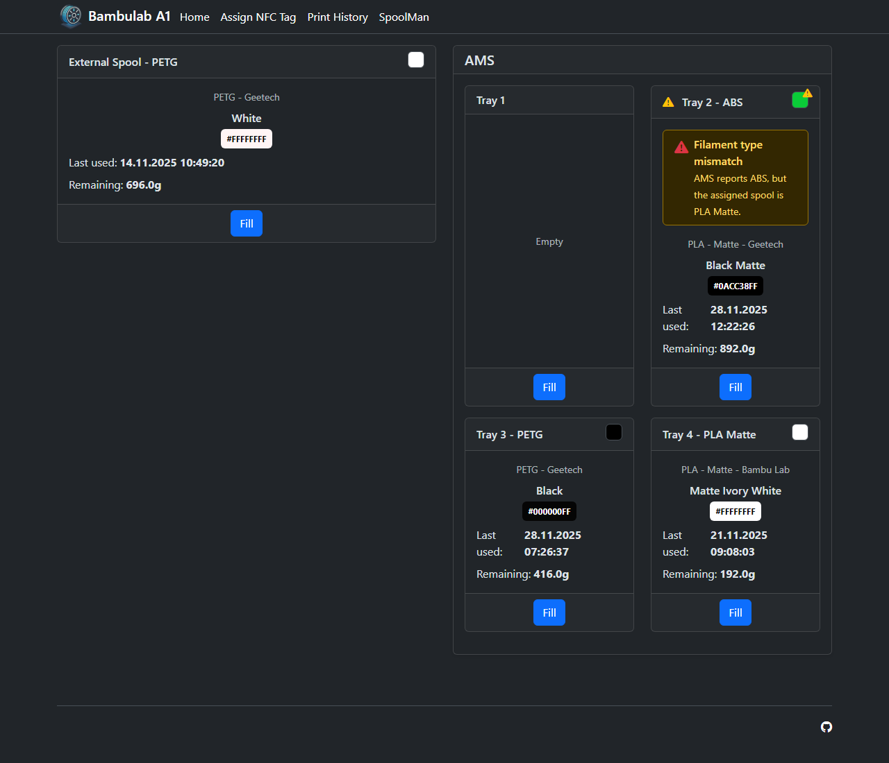

Desktop screenshots (expand to view)

##### Dashboard overview

##### Fill tray workflow
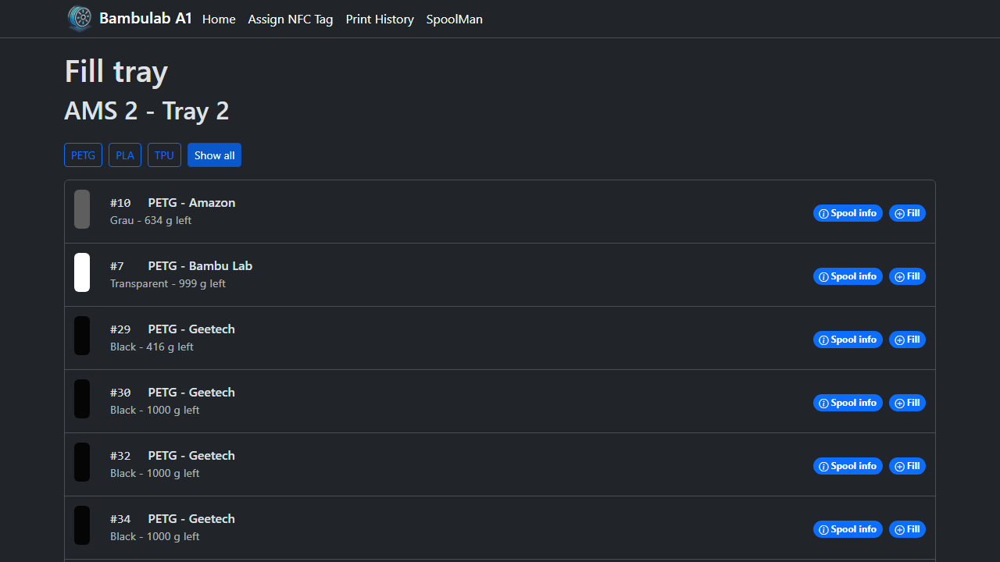

##### Print history
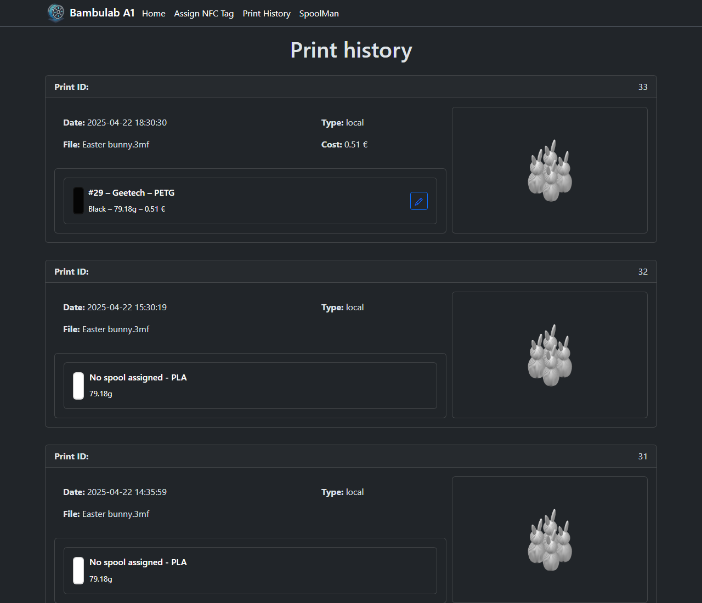

##### Spool detail info
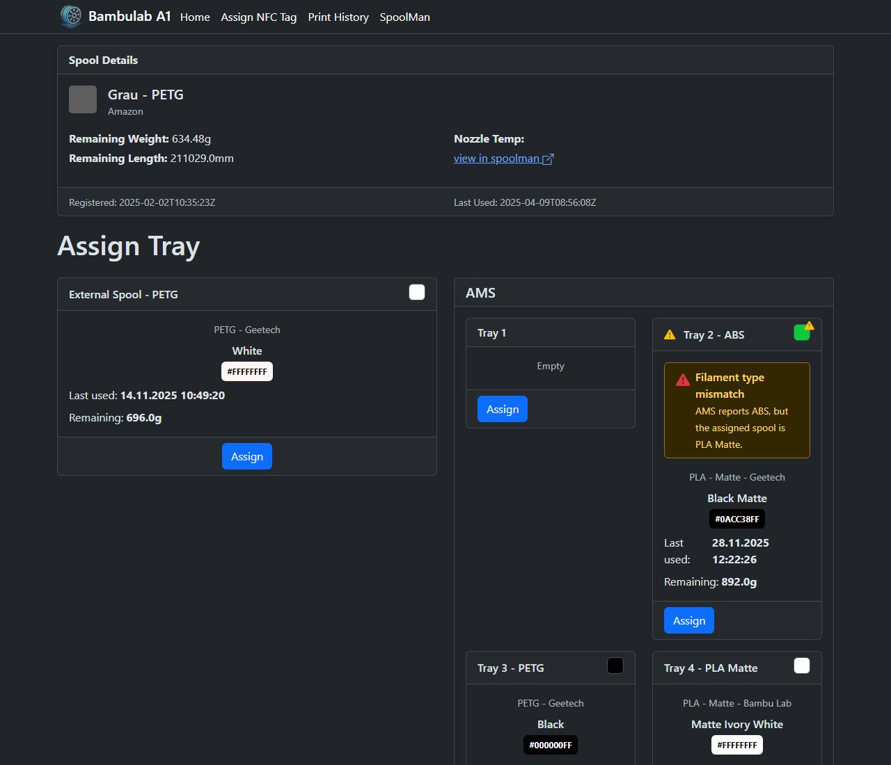

##### NFC tag assignment
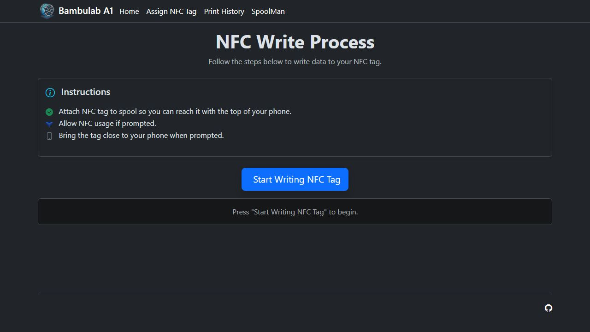

##### Slot change view
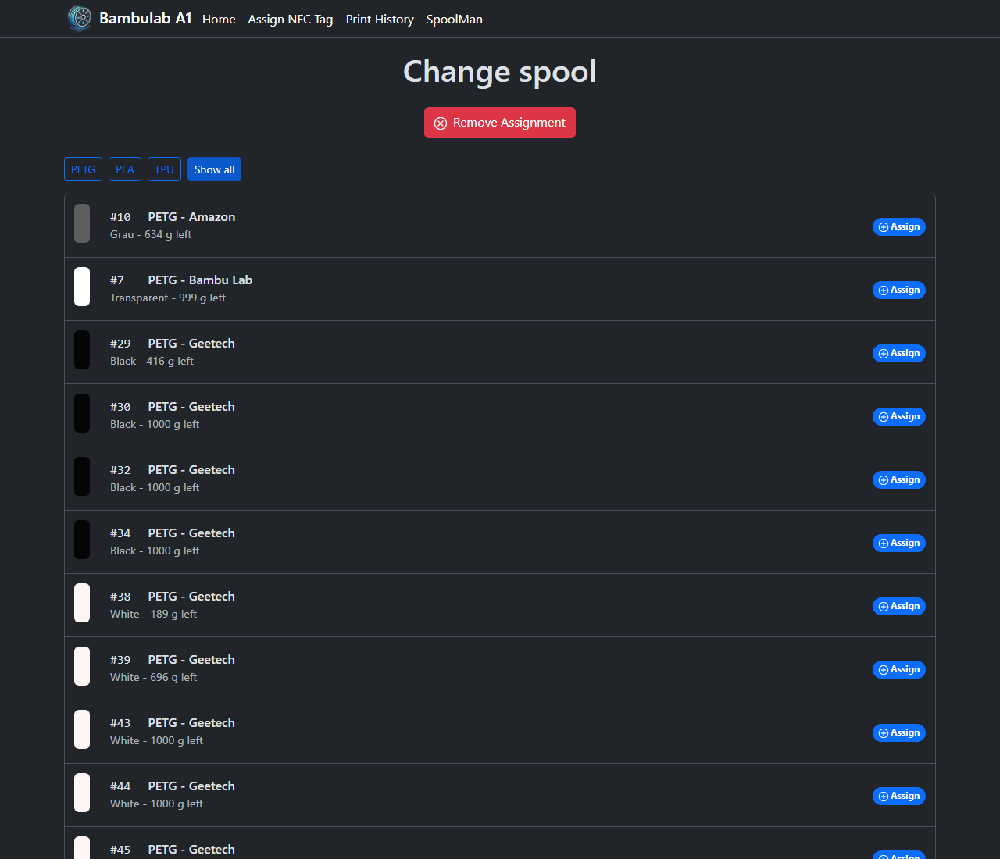

Mobile screenshots (expand to view)

<table>
  <tr>
    <td>
      <h5>Dashboard overview</h5>
      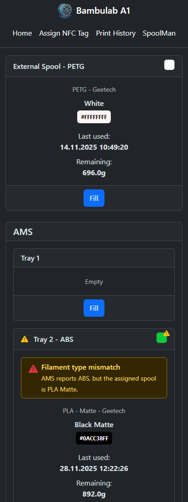
    </td>
    <td>
      <h5>Fill tray workflow</h5>
      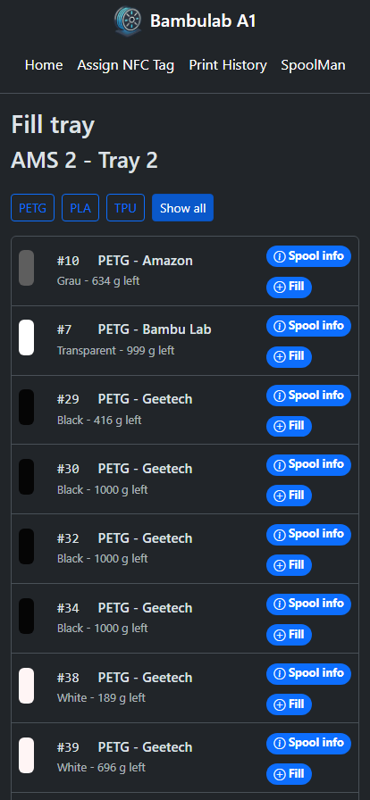
    </td>
  </tr>
  <tr>
    <td>
      <h5>Print history</h5>
      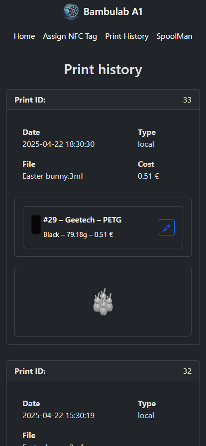
    </td>
    <td>
      <h5>Spool detail info</h5>
      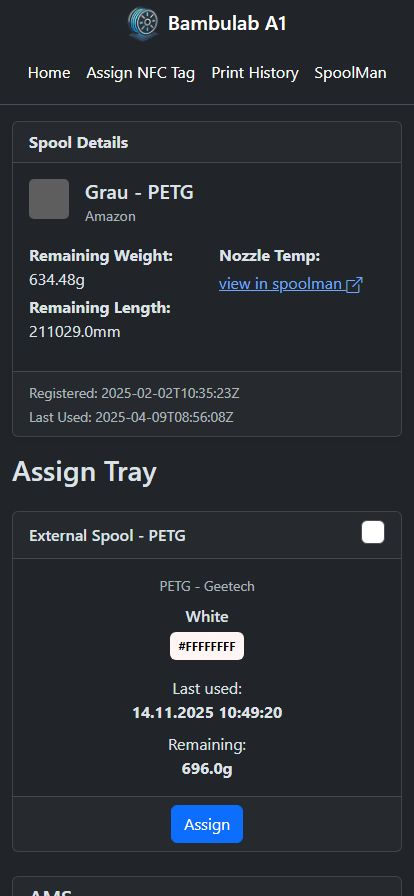
    </td>
  </tr>
  <tr>
    <td>
      <h5>NFC tag assignment</h5>
      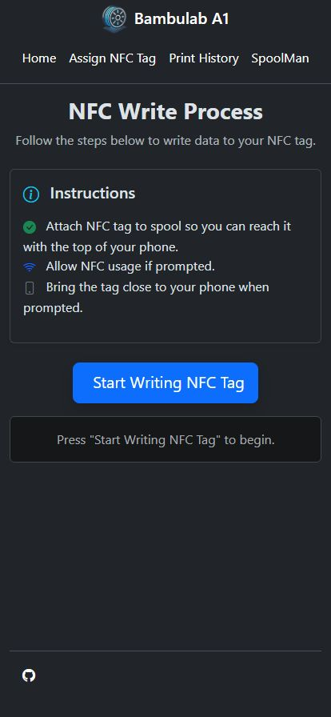
    </td>
    <td>
      <h5>Slot change view</h5>
      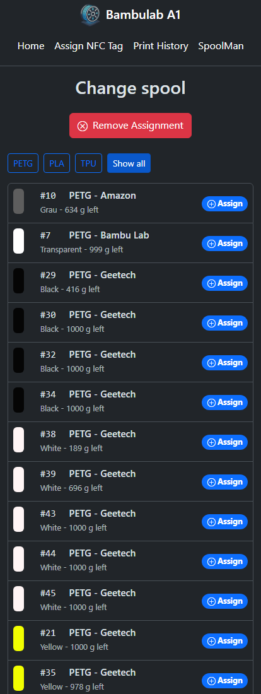
    </td>
  </tr>
</table>

### Screenshots
Details for the screenshot gallery and capture workflow live in [docs/screenshots.md](docs/screenshots.md).

### What you need:
 - Android Phone with Chrome web browser or iPhone (manual process much more complicated if using NFC Tags)
 - Server to run OpenSpoolMan with https (optional when not using NFC Tags) that is reachable from your Phone and can reach both SpoolMan and Bambu Lab printer on the network
 - Active Bambu Lab Account or PRINTER_ID and PRINTER_CODE on your printer
 - Bambu Lab printer https://eu.store.bambulab.com/collections/3d-printer
 - SpoolMan installed https://github.com/Donkie/Spoolman
 - NFC Tags (optional) https://eu.store.bambulab.com/en-sk/collections/nfc/products/nfc-tag-with-adhesive https://www.aliexpress.com/item/1005006332360160.html

### How to setup:
 - Rename config.env.template to config.env or set environment properies and: 
   - set OPENSPOOLMAN_BASE_URL - that is the URL where OpenSpoolMan will be available on your network. Must be https for NFC write to work. without trailing slash
   - set PRINTER_ID - On your printer clicking on Setting -> Device -> Printer SN
   - set PRINTER_ACCESS_CODE - On your printer clicking on Setting -> Lan Only Mode -> Access Code (you _don't_ need to enable the LAN Only Mode)
   - set PRINTER_IP - On your printer clicking on Setting -> Lan Only Mode -> IP Address (you _don't_ need to enable the LAN Only Mode)
   - set SPOOLMAN_BASE_URL - according to your SpoolMan installation without trailing slash
   - set AUTO_SPEND - to True if you want for system to track your filament spending (check AUTO_SPEND issues below) default to False
 - Run the server (wsgi.py)
 - Run Spool Man
 - Add following extra Fields to your SpoolMan:
   - Filaments
     - "type","Type","Choice","Basic","Silk, Basic, High Speed, Matte, Plus, Flexible, Translucent","No"
     - "nozzle_temperature","Nozzle Temperature","Integer Range","°C","190 – 230"
	 - "filament_id","Filament ID", "Text"
   - Spools
     - "tag","tag","Text"
     - "active_tray","Active Tray","Text
 - Add your Manufacturers, Filaments and Spools to Spool Man (when adding filament you can try "Import from External" for faster workflow)
 - The filament id can be found in the json files in C:\Users\USERNAME\AppData\Roaming\BambuStudio\user\USERID\filament\base
   It is the same for each printer and nozzle.
 - Open the server base url in browser on your mobile phone
 - Optionally add Bambu Lab RFIDs to extra tag on your Bambu Spools so they will be matching. You can get the tag id from logs or from browser in AMS info.

 With NFC Tags:
 - For non Bambu Lab filaments click on the filament and click Write and hold empty NFC tag to your phone (allow NFC in popup if prompted)
 - Attach NFC tag to your filament
 - Load filament to your AMS by loading it and then putting your phone near NFC tag and allowing your phone to open the website
 - On the website pick the slot you put your filament in

 Without NFC Tags:
 - Click fill on the tray and select the desired spool
 - Done

### Deployment
Run locally in venv by configuring environment properties and running wsgi.py, supports adhoc ssl.

Run in docker by configuring config.env and running compose.yaml, you will need more setup/config to run ssl.

Run in kubernetes using helm chart, where you can configure the ingress with SSL. https://github.com/truecharts/public/blob/master/charts/library/common/values.yaml

### AUTO SPEND - Automatic filament usage based on slicer estimate
You can turn this feature on to automatically update the spool usage in SpoolMan. 
This feature is using slicer information about predicted filament weight usage (and in future correlating it with the progress of the printer to compute the estimate of filament used).

This feature has currently following issues/drawbacks:
 - Spending on the start of the print
 - Not spending according to print process and spending full filament weight even if print fails
 - Don't know if it works with LAN mode, since it downloads the 3MF file from cloud
 - Not tested with multiple AMS systems
 - Not handling the mismatch between the SpoolMan and AMS (if you don't have the Active Tray information correct in spoolman it won't work properly)

### Notes:
 - If you change the BASE_URL of this app, you will need to reconfigure all NFC TAGS

### TBD:
 - Filament remaining in AMS (I have only AMS lite, if you have AMS we can test together)
 - Filament spending based on printing
   - TODO: handle situation when the print doesn't finish
   - TODO: test with multiple AMS
 - Code cleanup
 - Video showcase
 - Docker compose SSL
 - Logs
 - TODOs
 - Click to resolve issue - WIP
 - Reduce the amount of files in docker container
 - Cloud service for controlled redirect so you don't have to reconfigure NFC tags
 - QR codes
 - Add search to list of spools
